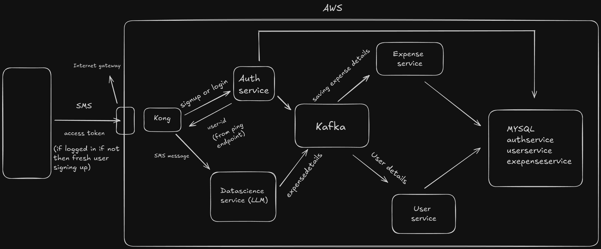

<!-- Improved compatibility of back to top link: See: https://github.com/othneildrew/Best-README-Template/pull/73 -->
<a id="readme-top"></a>
<!--
*** Thanks for checking out the Best-README-Template. If you have a suggestion
*** that would make this better, please fork the repo and create a pull request
*** or simply open an issue with the tag "enhancement".
*** Don't forget to give the project a star!
*** Thanks again! Now go create something AMAZING! :D
-->


<!-- PROJECT SHIELDS -->
<!--
*** I'm using markdown "reference style" links for readability.
*** Reference links are enclosed in brackets [ ] instead of parentheses ( ).
*** See the bottom of this document for the declaration of the reference variables
*** for contributors-url, forks-url, etc. This is an optional, concise syntax you may use.
*** https://www.markdownguide.org/basic-syntax/#reference-style-links
-->

<!-- PROJECT LOGO -->
<br />
<div align="center">
  <a href="https://github.com/saspal02/expense-tracker-app">
    
  </a>

<h3 align="center">EaseExpense</h3>

  <p align="center">
    An AI expenseTracker app to track your expense without your manual managing.
    <br />
    <a href="https://github.com/saspal02/expense-tracker-app"><strong>Explore the docs »</strong></a>
    <br />
    <br />
    <a href="https://github.com/user-attachments/assets/6f8f0e0e-6300-4014-87ab-8b6a29061d65">View Demo</a>
    &middot;
    <a href="https://github.com/saspal02/expense-tracker-app/issues/new?labels=bug&template=bug-report---.md">Report Bug</a>
    &middot;
    <a href="https://github.com/saspal02/expense-tracker-app/issues/new?labels=enhancement&template=feature-request---.md">Request Feature</a>
  </p>
</div>


<!-- TABLE OF CONTENTS -->
<details>
  <summary>Table of Contents</summary>
  <ol>
    <li>
      <a href="#about-the-project">About The Project</a>
      <ul>
        <li><a href="#built-with">Built With</a></li>
      </ul>
    </li>
    <li>
      <a href="#getting-started">Getting Started</a>
      <ul>
        <li><a href="#prerequisites">Prerequisites</a></li>
        <li><a href="#installation">Installation</a></li>
      </ul>
    </li>
    <li><a href="#usage">Usage</a></li>
    <li><a href="#roadmap">Roadmap</a></li>
    <li><a href="#contact">Contact</a></li>
    <li><a href="#acknowledgments">Acknowledgments</a></li>
  </ol>
</details>


<!-- ABOUT THE PROJECT -->
## About The Project

**EaseExpense** is an AI-powered expense tracker app designed to simplify your financial management by **automatically capturing your expenses from incoming SMS messages**.

### How it works:
- The app **listens for incoming SMS** on your phone, such as bank transaction alerts or payment notifications.
- Each SMS is sent securely to the backend server.
- The backend uses the **Mistral API key with a Large Language Model (LLM)** to **extract important details** like the transaction amount, currency, and merchant name.
- Extracted expenses are then displayed to you in an organized, user-friendly interface — **no manual entry required!**

With EaseExpense, managing your expenses becomes effortless and accurate, helping you stay on top of your budget without the hassle of manual tracking.

## Project structure



<p align="right">(<a href="#readme-top">back to top</a>)</p>

### Built With

| Technology      | Badge                                                                                                   |
|-----------------|---------------------------------------------------------------------------------------------------------|
| Java            | [](https://www.java.com/) |
| Spring Boot     | [](https://spring.io/projects/spring-boot) |
| Gradle          | [](https://gradle.org/) |
| Apache Kafka    | [](https://kafka.apache.org/) |
| Docker          | [](https://www.docker.com/) |
| MySQL           | [](https://www.mysql.com/) |
| Kong            | [](https://konghq.com/) |
| React Native    | [](https://reactnative.dev/) |

<p align="right">(<a href="#readme-top">back to top</a>)</p>

<!-- GETTING STARTED -->
## Getting Started

Follow below instructions to setup the environment if you want to test in the frontend follow this [Link](https://github.com/saspal02/expense-tracker-rn)

### Prerequisites

Make sure you have the following tools and credentials:

- [Docker](https://www.docker.com/get-started)
- [Docker Compose](https://docs.docker.com/compose/install/)
- (Optional) [Git](https://git-scm.com/downloads)
- **Mistral API Key** — Obtain your API key from [Mistral](https://mistral.ai/) and have it ready for configuring your environment


### Installation

1. Get a free API Key at [https://mistral.ai/)](https://mistral.ai/)


2. Clone the repo
   ```sh
   git clone https://github.com/github_username/repo_name.git
   ```
3. Navigate to expenseTrackerApp and make a .env file there
   ```sh
   MYSQL_USER=YOUR-USERNAME
   MYSQL_PASSWORD=YOUR_PASSWORD
   MYSQL_ROOT_USER=root
   MYSQL_ROOT_PASSWORD=password
   
   SPRING_AI_MISTRALAI_API_KEY= YOUR_API_KEY
   ```

<p align="right">(<a href="#readme-top">back to top</a>)</p>

<!-- USAGE EXAMPLES -->
## Usage

Navigate to expenseTrackerApp and up your containers to test it
   ```sh
   docker compose up -d
   ```

To test in the frontend, refer to this [Link](https://github.com/saspal02/expense-tracker-rn)

<p align="right">(<a href="#readme-top">back to top</a>)</p>


<!-- ROADMAP -->
## Roadmap

- [x] Listen for incoming SMS and generate expense in the app automatically
- [x] Add Logout feature
- [ ] Add Additional UI
- [ ] Add category level expenses
- [ ] Deploy the project in AWS

See the [open issues](https://github.com/saspal02/expense-tracker-app/issues) for a full list of proposed features (and known issues).

<p align="right">(<a href="#readme-top">back to top</a>)</p>


<!-- CONTACT -->
## Contact

[](https://twitter.com/saspal02)
[](https://www.linkedin.com/in/saswat-pal/)

<p align="right">(<a href="#readme-top">back to top</a>)</p>

<!-- ACKNOWLEDGMENTS -->
## Acknowledgments

* [Mistral AI](https://mistral.ai/)
* [Img Shields](https://shields.io)
* [Gluestack-UI](https://gluestack.io/)

<p align="right">(<a href="#readme-top">back to top</a>)</p>


